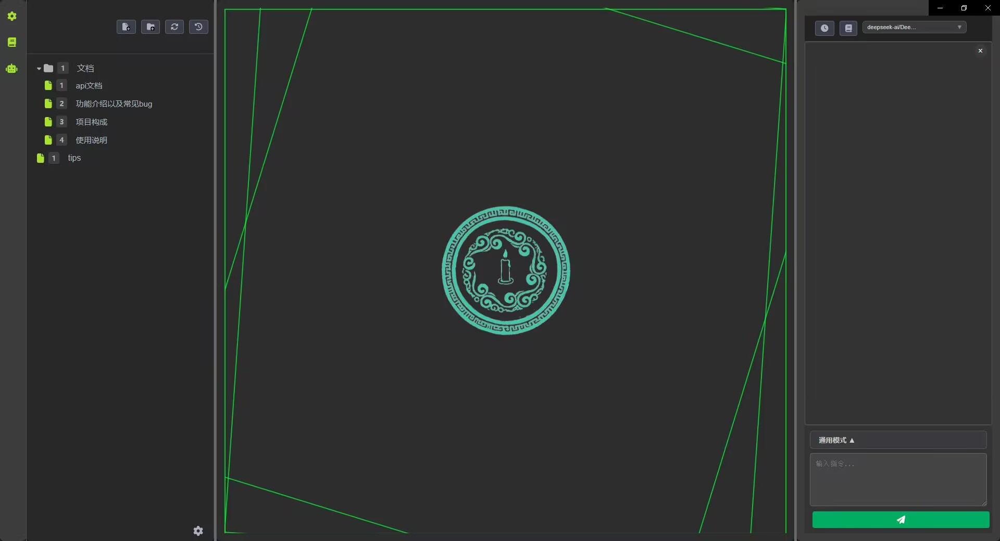

# AI小说家 MVP v1.1.0

[English Version](README_en.md) | 中文版


## 项目介绍

AI小说家 是一个基于 Electron 框架构建的桌面应用程序，旨在为用户提供一个AI辅助小说创作的平台。通过集成AI技术，帮助作者提升写作效率，激发创作灵感，并更有效地管理小说结构和内容。（这是完整构想，目前只实现基础功能，后续会继续完善）

**核心功能**:
*   **AI 智能交互**: 与AI进行实时对话，获取写作建议、角色设定、情节发展等方面的智能辅助，也可以让AI直接自行写作并将内容保存到本地文件。
*   **章节管理**: 用户/AI直观地创建、编辑、删除和组织小说的章节，清晰呈现作品结构。
*   **内容编辑器**: 提供基础的文本编辑界面，支持小说内容的撰写和修改。
*   **本地数据存储**: 小说内容安全地存储在本地文件系统，确保数据隐私和离线可用性。

## 技术栈

*   **Electron**: 用于构建跨平台的桌面应用程序，结合了Web技术（HTML、CSS、JavaScript）和原生能力。
*   **React.js**: 前端用户界面框架，提供高效的组件化开发模式和出色的用户体验。
*   **Node.js**: 后端服务运行时环境，负责处理与AI的交互、文件系统操作以及与前端的IPC通信。
*   **AI API集成**: 目前已统一集成DeepSeek-v3和DeepSeek-r1模型API，实验性支持本地Ollama模型（存在较多适配问题）。
*   **Redux**: 前端状态管理库，用于统一管理应用程序的复杂状态。
*   **Tiptap**: 优秀的富文本编辑器。
*   **electron-store**: 轻量级的Electron配置存储库，用于持久化应用程序设置，例如API Key。

## 特性

*   **AI 聊天交互**: 用户可以通过聊天界面与AI进行自然语言交流，请求AI生成文本、续写段落、提出创意、对现有内容进行修改和润色，能够帮助作者打破创作瓶颈，快速构思新的故事情节。
*   **章节管理**: 应用提供一个树形结构的章节导航面板，允许用户创建新章节、重命名、删除等操作，方便高效地构建和维护小说的整体框架。
*   **内容编辑器**: 内置的编辑器提供了基本的文本编辑功能，未来考虑扩展更多高级编辑体验，以提升写作效率。
*   **本地文件存储**: 所有小说内容都存储在用户本地的 `novel` 目录下，确保数据的安全性和私密性。应用会实时监听 `novel` 目录的变化，自动更新章节树和内容。
*   **API Key 配置**: 用户可在设置界面配置DeepSeek API Key。
*   **自定义系统提示词**: 支持用户在设置中自定义AI的系统提示词，以更好地控制AI的响应风格和内容。

## 架构概览

```mermaid
graph TD
    User -->|交互| Frontend(React App)
    Frontend -->|IPC 通信| ElectronMain(Electron 主进程)
    ElectronMain -->|调用| Backend(Node.js 后端服务)
    Backend -->|API 请求| DeepSeekAI(DeepSeek API)
    DeepSeekAI -->|AI 响应| Backend
    Backend -->|文件系统操作| LocalStorage(本地 novel 目录)
    Backend -->|IPC 通信| ElectronMain
    ElectronMain -->|IPC 通信| Frontend
    ElectronMain -->|配置存储| ElectronStore(electron-store)
```

## 快速开始

### 先决条件

*   Node.js (推荐 LTS 版本)
*   npm 或 yarn

### 安装

1.  **克隆仓库**:
    ```bash
    git clone git@github.com:18643751823/ai-novelist.git
    cd ai-novel
    ```

2.  **安装后端依赖**:
    在项目根目录 (`ai-novel/`) 下执行：
    ```bash
    npm install
    ```

3.  **安装前端依赖**:
    进入前端目录 (`ai-novel/frontend/react-app/`) 并执行：
    ```bash
    cd frontend/react-app
    npm install
    ```

### 运行应用

1.  **启动前端开发服务器 (可选，仅开发时使用)**:
    在 `ai-novel/frontend/react-app/` 目录下执行：
    ```bash
    npm start
    ```
    这将启动一个开发服务器，通常在 `http://localhost:3000`。

2.  **启动 Electron 应用**:
    然后回到项目根目录 (`ai-novel/`) 并执行：
    ```bash
    npm start # 或者 electron .
    ```
    这将启动桌面应用程序。

3.  **配置 DeepSeek API Key**:
    应用启动后，您需要在应用的设置界面中输入您的 DeepSeek API Key。此API Key将通过 `electron-store` 进行安全存储。

## 项目结构

```
ai-novel/
├── .gitignore                # Git 忽略文件配置
├── CONTRIBUTING_en.md        # 英文贡献指南
├── CONTRIBUTING.md           # 贡献指南
├── DeepSeek_API_说明.md      # DeepSeek API 说明
├── LICENSE                   # 项目许可证 (MIT 协议)
├── main.js                   # Electron 主进程入口文件
├── package-lock.json         # npm 锁定文件，记录依赖版本
├── package.json              # 项目主依赖配置 (Electron, 后端依赖等)
├── README_en.md              # 英文版 README
├── README.md                 # 本项目 README (您现在正在阅读的文件)
├── request.json              # 请求示例文件
├── Troubleshooting_Focus_Issues.md # 焦点问题排查
├── Troubleshooting_Left_Panel_Layout.md # 左侧面板布局问题排查
├── Troubleshooting_Rename_Input_Bug.md # 重命名输入框bug排查
├── backend/                  # 后端服务代码，处理AI交互、文件操作等
│   ├── engine/               # 核心引擎逻辑
│   │   ├── api/              # AI API 接口 (deepseek.js)
│   │   ├── ipc/              # IPC 通信处理器 (handlers.js)
│   │   ├── models/           # 模型管理
│   │   │   ├── adapters/     # 模型适配器
│   │   │   │   ├── baseAdapter.js  # 基础适配器
│   │   │   │   ├── deepseekAdapter.js # DeepSeek适配器
│   │   │   │   └── ollamaAdapter.js # Ollama适配器
│   │   │   ├── modelProvider.js # 模型提供者
│   │   │   └── modelRegistry.js # 模型注册
│   │   └── index.js          # 后端引擎入口
│   ├── mcp-service.js        # MCP 服务
│   ├── service-registry.js   # 服务注册
│   ├── state-manager.js      # 状态管理
│   ├── tool-service/         # 工具服务定义与执行
│   │   ├── tools/            # 具体工具实现 (definitions.js, executor.js)
│   │   └── index.js          # 工具服务入口
│   └── utils/                # 工具函数
│       ├── file-tree-builder.js # 文件树构建
│       └── logger.js         # 日志工具
├── frontend/                 # 前端应用代码
│   └── react-app/            # React 前端应用
│       ├── .gitignore
│       ├── Frontend_Refactoring_Plan.md # 前端重构计划
│       ├── package.json      # 前端依赖配置
│       ├── README.md         # 前端项目的 README
│       ├── public/           # 静态资源
│       │   ├── favicon.ico
│       │   ├── index.html
│       │   └── preload.js
│       ├── src/              # React 源代码
│       │   ├── App.css
│       │   ├── App.js
│       │   ├── index.css
│       │   ├── index.js
│       │   ├── components/   # UI 组件
│       │   │   ├── ChapterTreePanel.css
│       │   │   ├── ChapterTreePanel.js
│       │   │   ├── ChatHistoryPanel.css
│       │   │   ├── ChatHistoryPanel.js
│       │   │   ├── ChatPanel.css
│       │   │   ├── ChatPanel.js
│       │   │   ├── CombinedIcon.css
│       │   │   ├── CombinedIcon.js
│       │   │   ├── ConfirmationModal.js # 确认模态框
│       │   │   ├── ContextMenu.css
│       │   │   ├── ContextMenu.js
│       │   │   ├── EditorPanel.css
│       │   │   ├── EditorPanel.js
│       │   │   ├── LayoutComponent.js
│       │   │   ├── NotificationModal.css # 通知模态框样式
│       │   │   └── NotificationModal.js # 通知模态框
│       │   ├── hooks/        # 自定义 Hook (useIpcRenderer.js)
│       │   ├── ipc/          # IPC 通信
│       │   │   └── mainIpcHandler.js # 主进程IPC处理
│       │   └── store/        # Redux 状态管理
│       │       ├── slices/   # Redux 切片 (chatSlice.js, novelSlice.js)
│       │       └── index.js  # store 配置
├── images/                   # 图片资源
│   └── 示例图片.jpg          # 示例图片
└── novel/                    # 存储小说内容的目录 (运行时自动创建)
```

## 贡献规则
- 所有代码提交必须包含 `Signed-off-by` 行（符合 [DCO](https://developercertificate.org/)）。
- 贡献者确认其代码依据 [MIT 协议](LICENSE) 授权。
- 所有代码必须是原创或兼容 MIT 协议，不可附加额外限制。
- 禁止引入 GPL/AGPL 等非兼容许可证的代码。

我们欢迎并感谢所有贡献者！如果您有任何 Bug 报告、功能建议或希望提交代码，请随时通过 GitHub Issues 或 Pull Requests 与我们联系。

## 许可证

本项目采用 [MIT 许可证](LICENSE)，所有贡献者需通过 DCO 签署。项目维护者有权将代码用于闭源商业产品，并保持开源版的维护。

**未来发展与版权管理**:
本项目旨在成为一个活跃的开源项目。我们鼓励所有形式的贡献，并致力于确保项目在 MIT 许可框架下的合法合规性。目前，所有贡献均视为按 MIT 许可证授权。然而，为了应对未来可能出现的商业化需求或更严格的知识产权管理，项目可能会考虑引入 **CLA (贡献者许可协议)**，以彻底规避潜在的法律风险。届时，我们将在 `CONTRIBUTING.md` 中提供详细的 CLA 政策和签署流程。

## 下一版本发展目标

1.  **AI 模型集成与优化**: 在现有统一集成框架基础上，持续支持更多主流AI模型，并致力于解决Ollama本地模型适配性问题，提升本地部署的可用性与稳定性。
2.  **交互体验升级**:
    *   引入差异算法，回溯功能等，提升内容编辑与版本控制能力。
    *   支持多标签页功能、全面升级大模型的工具调用能力，初步实现类似Cursor IDE的智能代码/文本交互体验。
3.  **稳定性与性能提升**: 持续解决当前版本存在的各类Bug，优化应用性能，提高整体稳定性和用户体验。