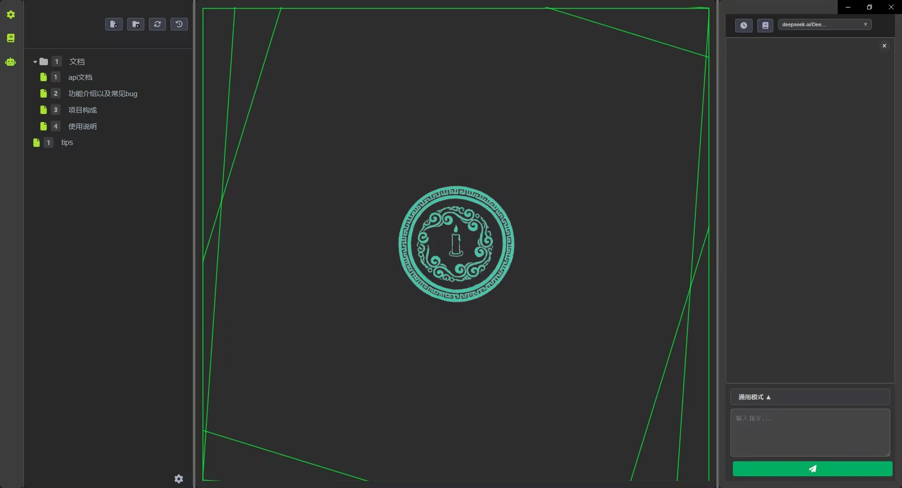

# Qingzhu v0.1.0

[中文版](README.md) | English Version

> **Version Note**: As this is a personal learning project, the previous version numbering was somewhat chaotic. We are restarting version management from v0.1.0.


## Project Introduction

Qingzhu (Official Name) is a desktop application built on the Electron framework, aiming to be a writing version AI IDE.

**Core Features**:
*   **AI Smart Interaction**: Real-time conversation with AI, from providing inspiration to content writing, revision and polishing, intelligent assistance throughout the entire writing process.
*   **Chapter Management**: Users/AI can intuitively create, edit, delete, and organize novel chapters, clearly presenting the work's structure.
*   **Content Editor**: Provides a basic text editing interface, supporting the writing and modification of novel content.
*   **Writing Style Imitation**: Based on RAG technology, analyzes text fragments and imitates writing styles.
*   **Tool Calling**: Supports calling tools to solve problems, similar to vibecoding.

## Technology Stack

*   **Electron**: Used to build cross-platform desktop applications, combining web technologies (HTML, CSS, JavaScript) with native capabilities.
*   **React.js**: Frontend user interface framework, providing efficient component-based development patterns and excellent user experience.
*   **Node.js**: Backend service runtime environment, responsible for handling AI interactions, file system operations, and IPC communication with the frontend.
*   **AI API Integration**: Supports DeepSeek, Open Router, Ollama, Silicon Flow model providers, providing a unified interface calling experience.
*   **LanceDB**: Vector database for RAG (Retrieval-Augmented Generation) functionality, providing semantic search and knowledge base management.
*   **Redux**: Frontend state management library, used to uniformly manage the application's complex state.
*   **Tiptap**: Excellent rich text editor.
*   **electron-store**: Lightweight Electron configuration storage library, used to persist application settings, such as API Key.
*   **LangChain**: Toolchain for building AI applications, currently has simple applications, and will further expand LangChain functionality implementation in the future.


## Quick Start

### Prerequisites

*   Node.js (LTS version recommended)
*   npm or yarn

### Installation

1.  **Clone the repository**:
    ```bash
    git clone git@github.com:FlickeringLamp/ai-novelist.git
    cd ai-novelist
    ```


2.  **Install dependencies**:
    Execute in the project root directory (`ai-novel/`):
    ```bash
    npm install
    ```


3.  **Build frontend application**:
    Return to the project root directory (`ai-novel/`) and execute the build:
    ```bash
    cd ../..
    npm run build
    ```

### Running the Application

**Start Electron application**:
Execute in the project root directory (`ai-novel/`):
```bash
npm run start:full .
```


## Contribution

We welcome all forms of contributions! If you find bugs, have feature suggestions, or wish to submit code, please feel free to participate via GitHub Issues or Pull Requests.

To maintain the project's healthy development, please ensure:
- Submitted code is compatible with the [MIT License](LICENSE)
- Avoid introducing code that is incompatible with the MIT License

**Note on DCO**: Previously, this project had DCO (Developer Certificate of Origin) requirements, but the checks were not properly removed. We have now completely removed all DCO checks and requirements. Contributors are no longer required to sign off on their commits.

Thank you for your support!

## License

This project uses the [MIT License](LICENSE).


---

## Acknowledgements

This project's development has been heavily inspired by the `roo-code` project. We extend our sincere gratitude to the developers of `roo-code`.

The `roo-code` project is licensed under the Apache License 2.0. In compliance with its terms, we have included the original license notice within our project, which can be found in the [`LICENSE-roo-code.txt`](./LICENSE-roo-code.txt) file.